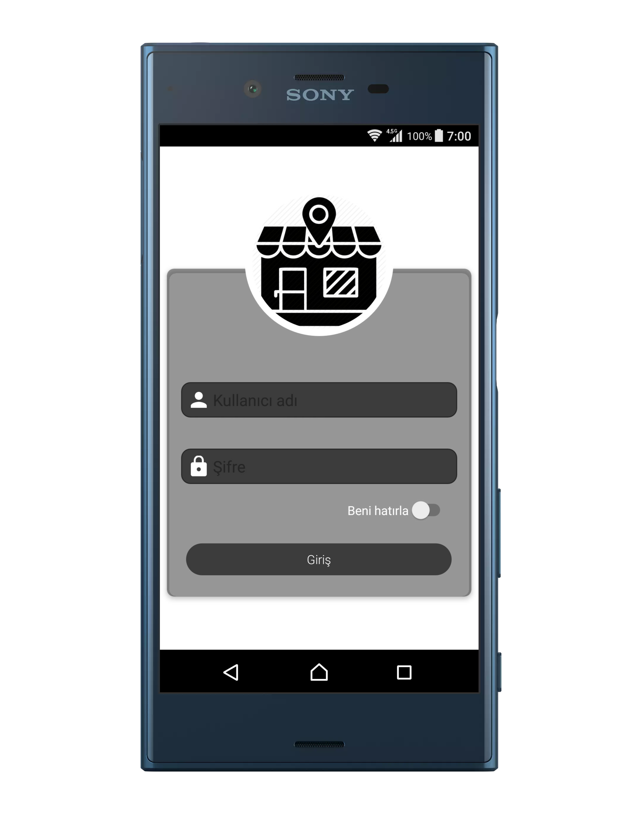
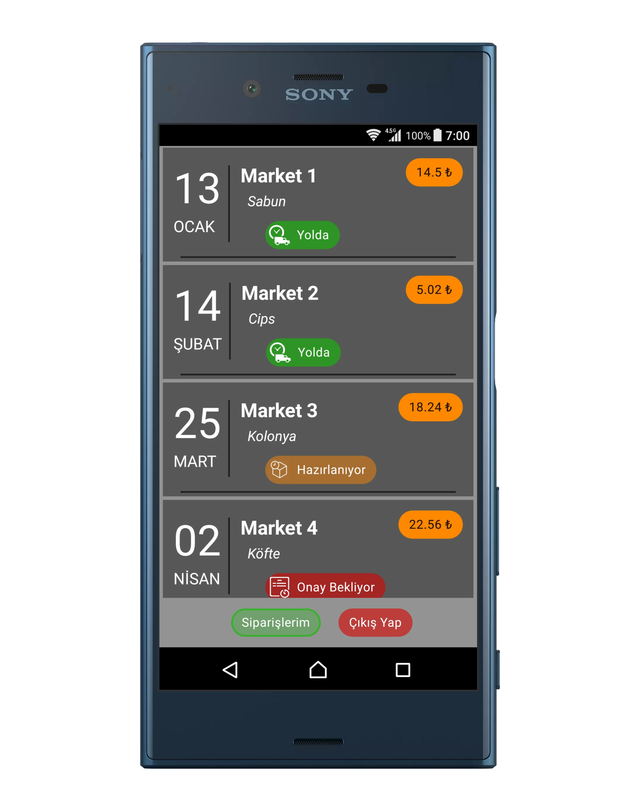
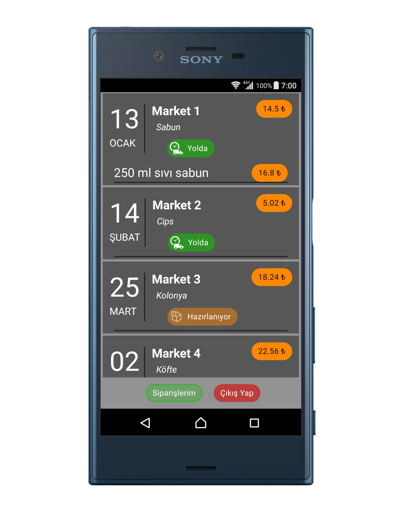

 
<h2>  
   Marketim</h2>
  
 
 
 
<B>TECH / challenge </B> 
The second race in Android Tech Challenge.

### Features

<ul>
 <li> App totally written by Java </li>
 <li> This app is written with the standards of high-quality code.</li>
 <li> Uses Androidx libraries.</li>
 <li> Uses Retrofit2 and RxJava.</li>
 <li> MVP architecture .</li>
 <li> Compatible with android 4.4 and above.</li>
 <li> Handeling most of the errors that may haapen. </li>
 <li> Third-party Libraries like (sweetalert Dialog, skeleton)</li>
 </ul>
 
 
 ### Screenshots
 
 
    

